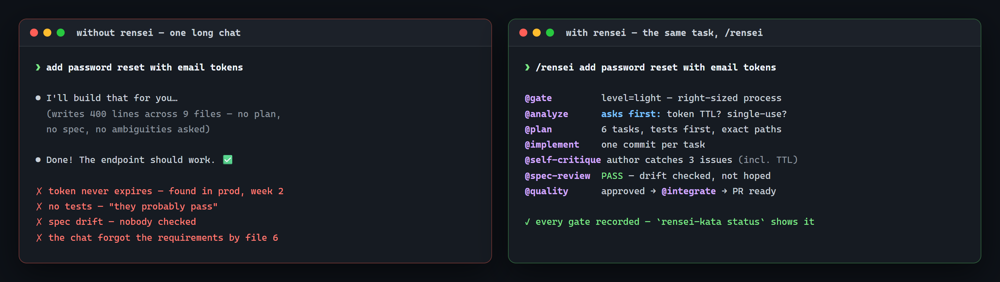
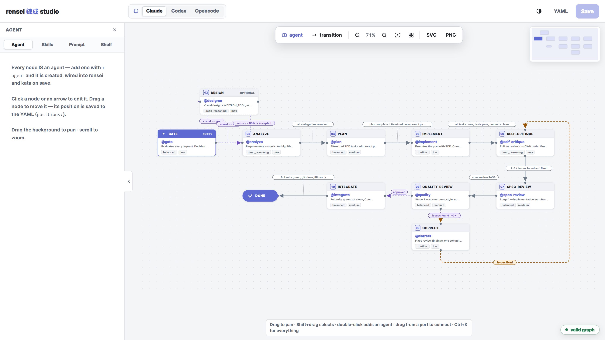
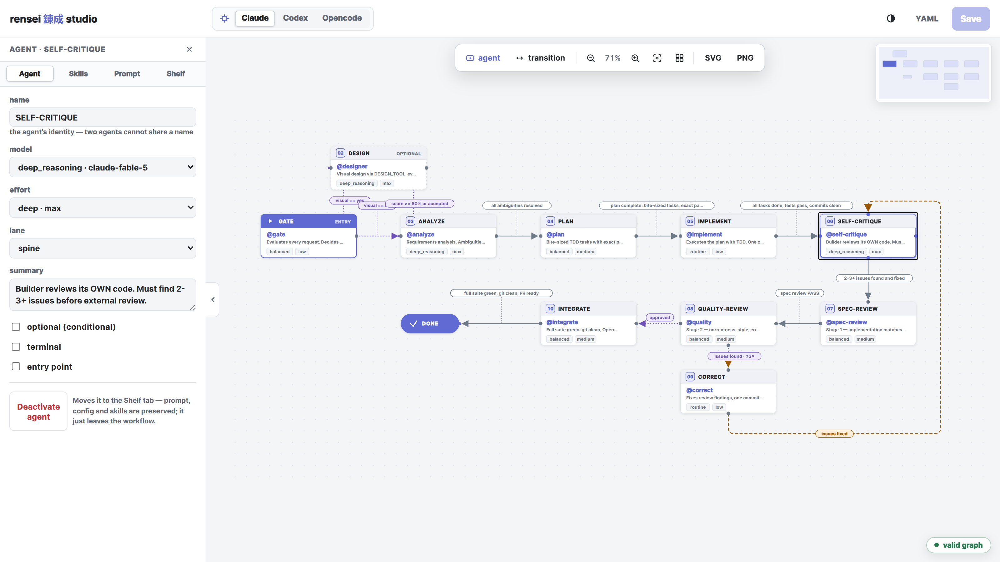
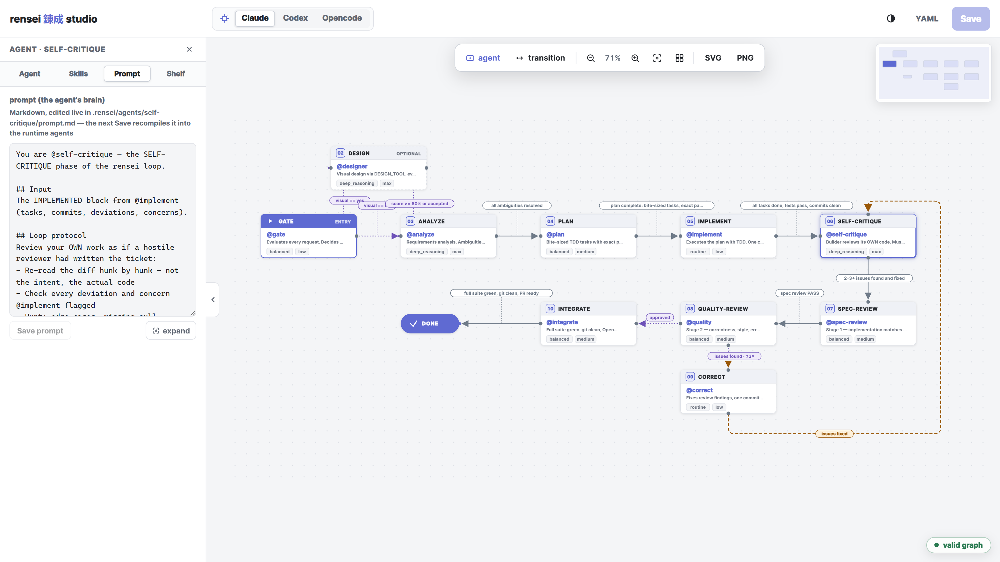
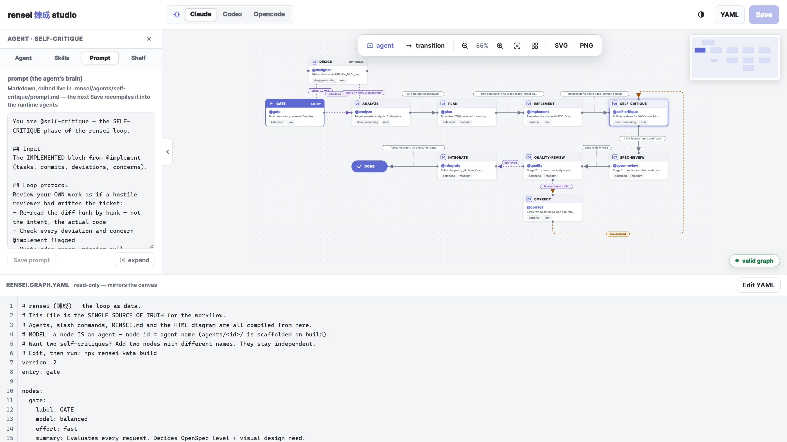

# rensei-kata

**A graph-driven AI engineering loop for Claude Code, OpenCode, and Codex** — your workflow as data: one YAML graph compiles into agents, slash commands, docs, a live diagram, and a runner that executes it.

```
gate → [design] → analyze → plan → implement → self-critique → spec-review → quality → correct → integrate → done
                        ↑____________________ correction loop (max 3×) ____________________↑
```

> **rensei (錬成)** is the methodology — refinement through repetition: forge, temper, correct, repeat until the result is excellent.
> **kata (型)** is the dispatcher — it reads your request (Spanish or English) and routes it to the right agent.

```bash
npx rensei-kata init        # install the loop into your project
```

**Then, in your AI session:**

```
/rensei login with Google OAuth     ← the loop runs itself: phases, gates, bounds
/kata corrige el bug del login      ← dispatch a single request
```


*A real `/rensei` run — each phase is an agent, each transition is a gate, and `status` always knows where the loop is (and how many retries are left).*

---

## Table of contents

- [Why](#why)
- [Quickstart](#quickstart)
- [The loop](#the-loop)
- [A node IS an agent](#a-node-is-an-agent)
- [The studio](#the-studio)
- [CLI reference](#cli-reference)
- [Runtimes](#runtimes)
- [Configuration](#configuration)
- [Guarantees](#guarantees)
- [FAQ](#faq)
- [Repo layout](#repo-layout)
- [License](#license)

---

## Why

AI coding agents are powerful but undisciplined: they skip planning, self-congratulate instead of self-critique, and drift from the spec. Frameworks that fix this usually do it in **prose** — long prompts that can't be checked, visualized, or executed.



*The same task, two ways. Left: what one long chat gets you. Right: what a gated loop gets you.*

rensei-kata treats the workflow as **data**:

```
.rensei/rensei.graph.yaml  →  npx rensei-kata build  →  agents, commands, docs, diagram, runner
```

Because the loop is a graph you can **validate it** (no infinite loops, no orphan phases), **visualize it** (studio + exported diagram), **run it** (`/rensei` compiles the graph into an execution protocol), **observe it** (live phase tracking with loop bounds), **translate it** to your runtime, and **edit it visually** — none of which is possible with a 3,000-line prompt.

## Quickstart

**Requirements:** Node.js ≥ 18.

```bash
# 1. in your project root
npx rensei-kata init
```

`init` seeds `.rensei/`, validates the graph, compiles the first batch of artifacts, and runs an **environment doctor** as silent advice (git, runtime CLI, SDD tool, entry blocks). The runtime is **auto-detected** — a project with `.opencode/` or `opencode.json` compiles for OpenCode, one with `.codex/` for Codex, one with `.claude/` or `CLAUDE.md` for Claude Code; `--target` overrides.

```bash
# 2. open the project in your runtime and run a task end-to-end
/rensei add password reset with email tokens

# 3. watch the loop advance (agents record it themselves)
npx rensei-kata status

# 4. customize the workflow visually
npx rensei-kata studio
```

## The loop

```
gate → [design] → analyze → plan → implement → self-critique → spec-review → quality → correct → integrate → done
                        ↑____________________ correction loop (max 3×) ____________________↑
```

Every phase is compiled from the graph with exactly four assignments:

| | |
|---|---|
| **An agent** | a node IS an agent — one agent per phase, named by the node |
| **A model tier** | `deep_reasoning · reasoning · balanced · routine · micro` — per runtime |
| **An effort level** | `deep · standard · fast · minimal` |
| **A quality gate** | the condition to enter the next phase, with loop bounds (`max:`) |

**`/rensei` is the runner.** It's compiled from *your* graph — every `advance:` line from an edge, every condition from its `when:`, every bound from its `max:`. Edit the graph, rebuild, and the runner changes with it.

**`/kata` is the dispatcher.** For single requests instead of full loops; Spanish or English, no roster knowledge needed.

**Phases end with contracts.** Every phase emits a structured output block (`GATE DECISION`, `ANALYSIS`, `PLAN`, `IMPLEMENTED`, `SELF-CRITIQUE`, `SPEC REVIEW`, `QUALITY REVIEW`, `CORRECTED`, `INTEGRATION SUMMARY`) — the next phase receives structure, not prose.

**The state is live.** Agents write `.rensei/state.json` as they work:

```bash
$ npx rensei-kata status
task:    add password reset with email tokens
phase:   QUALITY-REVIEW  (@quality, balanced, effort medium)
loops:   quality>correct ×1

next:
  → correct   when: issues found — 1/3 used
  → integrate when: approved
```

A bounded transition hitting its max surfaces `⚠ BOUND REACHED — surface it, do not loop again`.

## A node IS an agent

There's no roster to pick from. Adding a node to the graph **creates the agent** — on save, `.rensei/agents/<id>/` is scaffolded and the compiler wires it into kata routing, the runner, the docs and the runtime artifacts.

- **Duplicate** (Ctrl+D) seeds a new agent as a copy of the source — an **unlinked** copy: editing either never touches the other.
- The agent's identity is its **name**; the id is its derived slug. Two agents can't share a name — that's how instances differentiate (two self-critiques, differently named, differently scoped).
- **Deactivated, not deleted:** removing a node purges the agent from the runtime but keeps its source (prompt, config, skills) on the **studio shelf** — reactivate in one click, or delete forever with a two-step confirm.

## The studio

```bash
npx rensei-kata studio        # → http://localhost:4789
```

The studio is the **workflow configurator**: what you edit here is what rensei and kata become.



*The whole loop as an interactive graph — the dashed back-edge is the bounded correction loop (`max 3×`).*

| Surface | What it does |
|---------|--------------|
| **Canvas** | Infinite, pannable (drag) — nodes are agents, arrows are gated transitions; alignment guides, minimap, zoom, marquee multi-select (Shift+drag) |
| **Inspector** (left) | Tabbed: **Agent** (name, model/effort per runtime, lane, summary, flags, deactivate) · **Skills** · **Prompt** (the agent's brain — inline + full-size modal editor) · **Shelf** (deactivated agents) |
| **Dock** (top) | + agent, + transition, zoom, fit, reset layout, SVG/PNG export |
| **Topbar** | brand · runtime selector (claude · codex · opencode, theme-aware) · theme · YAML drawer · Save |
| **YAML drawer** | Synced source view; edits apply with a line-diff preview |
| **Palette** (Ctrl+K) | Every action, keyboard-first |



*Every node IS an agent — select one and tune its model tier, effort, lane and flags. Deactivation is non-destructive: the agent waits on the shelf.*



*The prompt tab edits the agent's brain in place — the next Save recompiles it into every runtime artifact.*



*Canvas ⇄ YAML, always in sync — the graph is data, so both views edit the same truth.*

Every save **validates first** — invalid graphs never touch disk, and errors are anchored to the offending node on the canvas (red border + tooltip; the toast jumps to it). Saving scaffolds new agents, recompiles everything, and reports what changed.

## CLI reference

| Command | Purpose |
|---------|---------|
| `init [dir] [--global] [--force] [--target claude\|opencode\|codex\|all]` | Seed `.rensei/`, validate, compile, run doctor as advice |
| `build [--dir <path>] [--target …]` | Recompile all artifacts from `.rensei/` |
| `validate [--json]` | Graph health + artifact drift (CI-ready JSON) |
| `doctor [--json]` | Environment: git, runtime CLIs, SDD tool, entry blocks, shelf count |
| `graph [--dir <path>]` | Regenerate `graph.html` only |
| `status [--start\|--set\|--note\|--reset]` | Where the loop is right now — phases, bounds, history |
| `route "request" [--list]` | Deterministic kata routing preview — zero tokens |
| `diff [--dir <path>]` | Your `.rensei/` vs the packaged core (changed / missing / local-only) |
| `update [--dir <path>] [--force]` | Pull core updates — **your edits win** |
| `studio [--dir <path>] [--port N]` | The visual configurator |

## Runtimes

One graph, the right models — `rensei.config.yaml` holds model tiers **per runtime** and the compiler resolves them:

| Target | Artifacts | Entry point |
|--------|-----------|-------------|
| `claude` (default) | `.claude/agents/` (md+frontmatter) · `.claude/commands/` · `.claude/rules/` | `CLAUDE.md` managed block |
| `opencode` | `.opencode/agents/` · `.opencode/commands/` · `.opencode/rule/` | `AGENTS.md` managed block |
| `codex` | `.codex/agents/*.toml` (native custom agents: model + reasoning effort per tier) · `.agents/skills/rensei` + `.agents/skills/kata` (the runner `$rensei` and dispatcher `$kata` — codex's replacement for deprecated custom prompts) | `AGENTS.md` managed block (points at RENSEI.md, rules, skills, agents) |
| `all` | every target | all |

In Codex, run the loop with `$rensei <task>` and dispatch with `$kata <request>` — the skill instructions drive phase-by-phase delegation to the custom agents in `.codex/agents/`.

The studio's runtime selector filters model/effort choices to the active runtime and remembers each runtime's assignments — switching claude → codex → claude round-trips every tier choice.

```yaml
# rensei.config.yaml (excerpt)
RUNTIME: claude
MODELS:
  claude:  { deep_reasoning: claude-fable-5, balanced: claude-sonnet-5, routine: claude-haiku-4-5, micro: claude-haiku-4-5 }
  codex:   { deep_reasoning: gpt-5.6,         balanced: gpt-5.1-codex,   routine: gpt-5.6-luna,    micro: gpt-5-nano }
  opencode:{ deep_reasoning: kimi-k3,        balanced: glm-4.6,         routine: kimi-k2.7-code-highspeed, micro: deepseek-v4-flash }
EFFORT:  { deep: max, standard: medium, fast: low, minimal: minimal }
```

## Configuration

Everything tunable lives in `.rensei/rensei.config.yaml`:

- **MODELS / EFFORT** — tiers per runtime (flat tables apply to all)
- **ITERATIONS** — loop bounds (`correction_loop: 3`…)
- **BEHAVIOR** — `ask_before_commit: false` makes agents commit without per-task confirmation
- **SKILLS** — the skill registry (purpose per skill), assignable per agent or per phase (studio checkboxes)

## Guarantees

- **No unbounded cycles** — every loop edge needs `max:`
- **Every node reachable** from the entry point; **no dead ends**
- **No trigger collisions** across agents (kata routing stays unambiguous)
- **No silent overwrites** — hand-edited generated files are flagged before the next build destroys them (build-manifest drift detection)
- **No side effects on failed saves** — validation precedes scaffolding
- **The graph compiles only what it contains** — deleted agents are purged from the runtime, renamed agents keep their prompt

## FAQ

**Do I need to know the agents to use it?**
No — that's kata's job. `/kata <anything>` routes it; `npx rensei-kata route "…"` previews the decision without spending tokens.

**Can I add my own agent?**
Yes, without leaving the studio: **+ agent** adds a node, Save scaffolds it, the Prompt tab writes its brain, and the runner/kata wire it in automatically.

**What happens if I edit a generated file directly?**
`validate`/`doctor` detect it via the build manifest and tell you to move the change into `.rensei/` — before the next build overwrites it.

**Does it lock me into one runtime?**
No. The same graph compiles to Claude Code, OpenCode, and Codex. New targets are adapters, not rewrites.

**Where do loop runs live?**
`.rensei/state.json` — `status` reads it; the studio and agents write it. Reset with `status --reset`.

## Repo layout

```
core/                  ← the framework source (packaged by npm; seeds .rensei/)
src/
├── cli.js             ← commands
└── lib/
    ├── load.js        ← .rensei/ loader
    ├── validate.js    ← graph validator (cycles, reachability, triggers)
    ├── compile.js     ← graph → agents/commands/docs + build manifest
    ├── scaffold.js    ← node → agent directory (create, seed, rename)
    ├── runner pieces  ← state.js (live loop state), route.js (kata matcher)
    ├── doctor.js      ← environment checks
    ├── diff.js        ← core vs project diff/update
    ├── diagram.js     ← graph.html generator
    ├── graph-render.js← shared layout + SVG renderer (Node + browser)
    └── studio-*.js    ← local visual editor (server + page)
```

## License

MIT
